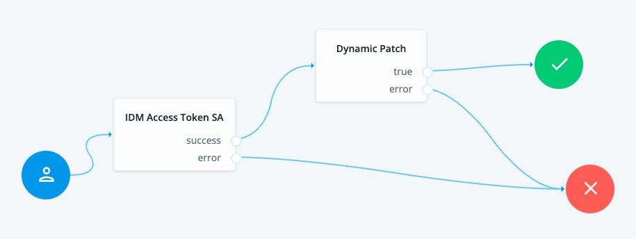

# Dynamic patch node

## Introduction

Sample JS scripted node that can patch multiple attributes with different operations.

## Contents

Example AM tree



## Configuration

Create an AM scripted decision node using the node in the [src](src) directory

- dynamic-patch.js

In the node configuration, you can specify which attributes to patch (assuming they are present in the objectAttributes object along with the patch operation (replace/add/remove):
```
var attributesAllowList = {
    frIndexedDate2: "replace", // last login
    sn: "replace",
    givenName: "replace",
    frUnindexedString2: "replace", // login method
    telephoneNumber: "replace"
};
```
Create a journey using the tree above as a reference. 

## Testing 

Test the tree with 2 attributes that are present in the objectAttributes and need patching:
```
{"context":"default","level":"DEBUG","logger":"dynamic-patch-node (27fb5163-c9cc-4c0e-9afa-ff8acaac82cd)","mdc":{"transactionId":"0362296c-035e-4e0d-9918-f1720d344e18-request-6/0"},"message":"******dynamic-patch-node node executing","thread":"ScriptEvaluator-5","timestamp":"2023-10-30T08:53:38.739Z","transactionId":"0362296c-035e-4e0d-9918-f1720d344e18-request-6/0"}
{"context":"default","level":"DEBUG","logger":"dynamic-patch-node (27fb5163-c9cc-4c0e-9afa-ff8acaac82cd)","mdc":{"transactionId":"0362296c-035e-4e0d-9918-f1720d344e18-request-6/0"},"message":"******dynamic-patch-node Calling: https://openam-franchise1-euw4-dev.id.forgerock.io/openidm/managed/alpha_user/6575cd34-a5c8-4fa6-8331-9ee53256a0b4","thread":"ScriptEvaluator-5","timestamp":"2023-10-30T08:53:38.739Z","transactionId":"0362296c-035e-4e0d-9918-f1720d344e18-request-6/0"}
{"context":"default","level":"DEBUG","logger":"dynamic-patch-node (27fb5163-c9cc-4c0e-9afa-ff8acaac82cd)","mdc":{"transactionId":"0362296c-035e-4e0d-9918-f1720d344e18-request-6/0"},"message":"******dynamic-patch-node Found objectAttributes: {mail=anastasios.kampas@forgerock.com, userName=anastasios.kampas@forgerock.com-4e2cd79a-46b1-4806-bb42-40ef7a951f84, telephoneNumber=+123456789, frUnindexedString2=phone}","thread":"ScriptEvaluator-5","timestamp":"2023-10-30T08:53:38.739Z","transactionId":"0362296c-035e-4e0d-9918-f1720d344e18-request-6/0"}
{"context":"default","level":"DEBUG","logger":"dynamic-patch-node (27fb5163-c9cc-4c0e-9afa-ff8acaac82cd)","mdc":{"transactionId":"0362296c-035e-4e0d-9918-f1720d344e18-request-6/0"},"message":"******dynamic-patch-node Adding telephoneNumber to request body with value +123456789 and patch operation replace","thread":"ScriptEvaluator-5","timestamp":"2023-10-30T08:53:38.740Z","transactionId":"0362296c-035e-4e0d-9918-f1720d344e18-request-6/0"}
{"context":"default","level":"DEBUG","logger":"dynamic-patch-node (27fb5163-c9cc-4c0e-9afa-ff8acaac82cd)","mdc":{"transactionId":"0362296c-035e-4e0d-9918-f1720d344e18-request-6/0"},"message":"******dynamic-patch-node Adding frUnindexedString2 to request body with value phone and patch operation replace","thread":"ScriptEvaluator-5","timestamp":"2023-10-30T08:53:38.740Z","transactionId":"0362296c-035e-4e0d-9918-f1720d344e18-request-6/0"}
{"context":"default","level":"DEBUG","logger":"dynamic-patch-node (27fb5163-c9cc-4c0e-9afa-ff8acaac82cd)","mdc":{"transactionId":"0362296c-035e-4e0d-9918-f1720d344e18-request-6/0"},"message":"******dynamic-patch-node Scripted Node HTTP Response: [Status: 200 OK], Body: {\"_id\":\"6575cd34-a5c8-4fa6-8331-9ee53256a0b4\",\"_rev\":\"27cdab95-2def-4f6d-a1b8-403144a161ff-46726\",\"custom_emailValidationJWTVerifier\":null,\"country\":null,\"mail\":\"anastasios.kampas@forgerock.com\",\"memberOfOrgIDs\":[\"4e2cd79a-46b1-4806-bb42-40ef7a951f84\",\"5cbd0f30-b96e-4cfd-b4c8-92680db43da3\"],\"frIndexedDate5\":null,\"frUnindexedString2\":\"phone\",\"assignedDashboard\":[],\"frIndexedDate4\":null,\"frUnindexedString3\":null,\"frIndexedDate3\":null,\"frUnindexedString4\":null,\"postalCode\":null,\"frUnindexedString5\":null,\"profileImage\":null,\"frIndexedString5\":null,\"frIndexedString4\":null,\"frIndexedString3\":null,\"frIndexedString2\":null,\"frIndexedString1\":null,\"frIndexedMultivalued3\":[],\"frUnindexedInteger5\":null,\"consentedMappings\":[],\"frIndexedMultivalued4\":[],\"frUnindexedInteger4\":null,\"frIndexedMultivalued5\":[],\"frUnindexedInteger3\":null,\"frUnindexedInteger2\":null,\"frIndexedMultivalued1\":[\"Customer\"],\"frIndexedMultivalued2\":[],\"frUnindexedInteger1\":null,\"givenName\":\"Tasos\",\"stateProvince\":null,\"postalAddress\":null,\"telephoneNumber\":\"+123456789\",\"city\":null,\"displayName\":null,\"effectiveAssignments\":[],\"description\":null,\"accountStatus\":\"active\",\"frUnindexedDate3\":null,\"frUnindexedMultivalued1\":[],\"frUnindexedDate2\":null,\"frUnindexedDate5\":null,\"frUnindexedMultivalued3\":[],\"frUnindexedDate4\":null,\"frUnindexedMultivalued2\":[],\"aliasList\":[],\"frUnindexedMultivalued5\":[],\"frUnindexedMultivalued4\":[],\"kbaInfo\":[],\"frIndexedInteger4\":null,\"frIndexedInteger3\":null,\"frIndexedInteger2\":null,\"isMemberOf\":null,\"frIndexedInteger1\":null,\"sn\":\"Kampas\",\"frUnindexedDate1\":null,\"frIndexedInteger5\":null,\"preferences\":null,\"userName\":\"anastasios.kampas@forgerock.com-4e2cd79a-46b1-4806-bb42-40ef7a951f84\",\"frIndexedDate2\":\"2023-10-27T10:14:38.319Z\",\"frIndexedDate1\":null,\"effectiveRoles\":[]}","thread":"ScriptEvaluator-5","timestamp":"2023-10-30T08:53:38.844Z","transactionId":"0362296c-035e-4e0d-9918-f1720d344e18-request-6/0"}
{"context":"default","level":"ERROR","logger":"dynamic-patch-node (27fb5163-c9cc-4c0e-9afa-ff8acaac82cd)","mdc":{"transactionId":"0362296c-035e-4e0d-9918-f1720d344e18-request-6/0"},"message":"******dynamic-patch-node User patched - 200 OK","thread":"ScriptEvaluator-5","timestamp":"2023-10-30T08:53:38.844Z","transactionId":"0362296c-035e-4e0d-9918-f1720d344e18-request-6/0"}
```
